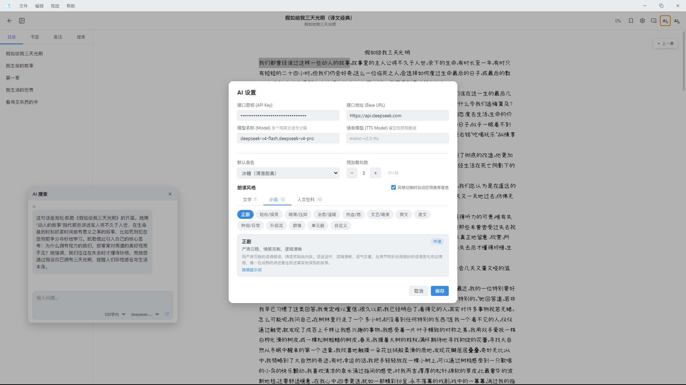
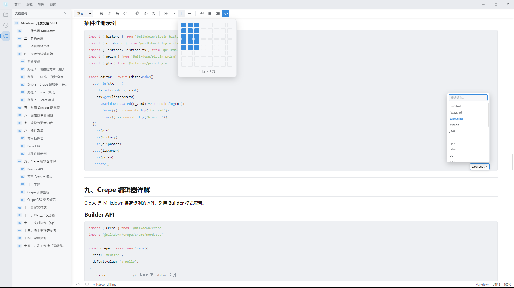

<p align="center">
  
</p>

<h1 align="center">简阅</h1>

<p align="center">
  简而阅之 • 简而记之
</p>

<p align="center">
  <a href="#功能特性">功能特性</a> ·
  <a href="#技术栈">技术栈</a> ·
  <a href="#开发指南">开发指南</a> ·
  <a href="#下载安装">下载安装</a> ·
  <a href="#license">License</a>
</p>

<p align="center">
  
  
  
  
  
</p>

---

## 截图预览

<table align="center">
  <tr>
    <td></td>
    <td></td>
  </tr>
  <tr>
    <td></td>
    <td></td>
  </tr>
</table>

---

## 功能特性

### 简阅 — 阅读引擎（基于 [foliate-js](https://github.com/nicm42/foliate-js)）

电子书阅读核心由 [foliate-js](https://github.com/nicm42/foliate-js) 驱动，这是一款纯 JavaScript 的 EPUB 渲染引擎。

| 能力 | 说明 |
|------|------|
| **多格式支持** | EPUB、TXT、MOBI、AZW3、CBZ、CBR，拖拽即可导入 |
| **智能编码检测** | TXT 自动识别 UTF-8 / GBK / GB2312 / GB18030，告别乱码 |
| **智能章节检测** | 自动识别中文章节（第X章/回/节/卷）、英文（Chapter X）、数字编号等 |
| **EPUB 封面提取** | 支持 OPF 元数据解析，兼容非标准封面文件名 |
| **13 套阅读主题** | 羊皮纸、竹林绿、暖沙、天青、深夜绿、墨夜金、深海蓝、烛火、冷白、纯白、薰衣草、深灰、护目黄 |
| **滚动 / 单页 / 双页模式** | 自由切换阅读布局 |
| **字体排版调节** | 字号、行高、字间距随心定制，支持自定义字体上传（TTF/OTF/WOFF/WOFF2） |
| **多色高亮划线** | 黄、绿、蓝、粉、下划线五种标注样式 |
| **备注系统** | 标注文字即时备注，悬停显示备注内容 |
| **书签管理** | 一键添加书签，侧边栏快速跳转 |
| **全文搜索** | 书内关键词检索，结果高亮定位 |
| **进度记忆** | 自动保存阅读位置，下次打开继续阅读 |
| **图片放大预览** | 点击书中图片即时放大 |
| **备注导出** | 一键导出全部备注为 Markdown 文件 |
| **AI 对话助手** | 接入 OpenAI 兼容 API，流式对话、字数限制、多模型切换 |
| **TTS 语音朗读** | 支持多种音色（冰糖/苏打/茉莉/白桦等），28 种朗读风格，逐句高亮同步 |

### 简记 — 笔记引擎（基于 [Milkdown](https://milkdown.dev/)）

笔记编辑器由 [Milkdown](https://milkdown.dev/) 驱动，一款基于 ProseMirror 的所见即所得 Markdown 编辑器。

| 能力 | 说明 |
|------|------|
| **所见即所得编辑** | Markdown 语法实时渲染，流畅书写体验 |
| **镜像笔记浮窗** | 从阅读器中提取文字生成浮动笔记窗口，可拖拽、可置顶、可调透明度 |
| **源码模式** | 支持切换到 Markdown 源码编辑，大纲快速跳转 |
| **代码块语法高亮** | 支持 100+ 编程语言高亮，代码块语言切换器 |
| **文件树管理** | 侧边栏文件目录，章节新建/重命名/排序，EPUB 目录自动收敛 |
| **章节图片插入** | 支持粘贴/选择图片插入章节，自动管理图片资源 |
| **EPUB 导出** | 笔记目录一键导出为 EPUB 电子书，支持封面设置 |
| **自动保存** | 内容变更防抖自动保存到磁盘，持续编辑不打断 |
| **笔记管理** | 侧边栏浏览所有笔记，快速定位与切换 |
| **文字缩放** | Ctrl + 滚轮调整编辑器文字大小（50%~200%） |

### 模式切换

点击左上角 Logo 图标即可在 **简阅（阅读模式）** 和 **简记（笔记模式）** 之间切换，切换时自动检测未保存更改。

### 悬浮阅读器

独立的浮动阅读窗口，可置顶、可调透明度，边工作边阅读。

### 系统文件关联

安装后自动关联 `.epub` `.txt` `.mobi` `.azw3` `.cbz` `.cbr` `.md` 文件，双击即可用简阅打开。

### 安全与隐私

- API Key 等敏感数据本地加密存储
- 可配置授权目录，限制文件访问范围
- 所有数据本地存储，不上传云端

---

## 技术栈

| 层级 | 技术 |
|------|------|
| **阅读引擎** | [foliate-js](https://github.com/nicm42/foliate-js) — 纯 JavaScript EPUB 渲染引擎 |
| **笔记引擎** | [Milkdown](https://milkdown.dev/) 7.x — 基于 ProseMirror 的 WYSIWYG Markdown 编辑器 |
| **前端框架** | [Vue 3](https://vuejs.org/) + [Pinia](https://pinia.vuejs.org/) + [TypeScript](https://www.typescriptlang.org/) |
| **桌面框架** | [Electron](https://www.electronjs.org/) 28 |
| **构建工具** | [Vite](https://vitejs.dev/) 5 + [electron-builder](https://www.electron.build/) 24 |
| **代码高亮** | [Prism.js](https://prismjs.com/) + [Refractor](https://github.com/wooorm/refractor) |
| **UI 图标** | [Lucide](https://lucide.dev/) |
| **样式** | 原生 CSS + CSS 变量主题系统 + Sass |
| **数据存储** | IndexedDB（加密存储）+ electron-store |

---

## 项目结构

```
简阅/
├── electron/                  # Electron 主进程
│   ├── main.ts                # 主进程入口
│   ├── preload.ts             # preload 脚本（context桥接）
│   ├── windowFactory.ts       # 窗口工厂（主窗口/悬浮窗）
│   ├── tray.ts                # 系统托盘
│   ├── security.ts            # 安全模块（加密/授权目录）
│   ├── epubBuilder.ts         # EPUB 导出构建器
│   └── ipc/                   # IPC 通信模块
│       ├── ai.ts              # AI 对话相关
│       ├── book.ts            # 书籍管理
│       ├── epub.ts            # EPUB 处理
│       ├── fileTree.ts        # 文件树操作
│       ├── font.ts            # 字体管理
│       ├── fs.ts              # 文件系统
│       ├── image.ts           # 图片处理
│       └── ...                # 其他 IPC 模块
├── src/
│   ├── components/
│   │   ├── book/              # 书籍卡片组件
│   │   ├── common/            # 通用组件（Tooltip、对话框等）
│   │   ├── note/              # 笔记侧边栏/工具栏组件
│   │   ├── reader/            # 阅读器组件（Viewer、设置、TTS 等）
│   │   └── sidebar/           # 侧边栏面板组件
│   ├── composables/           # 组合式函数
│   │   ├── useNoteImage.ts    # 笔记图片管理
│   │   ├── useSystemFonts.ts  # 系统字体加载
│   │   └── useExternalFileOpen.ts  # 外部文件打开
│   ├── editor/                # 编辑器扩展
│   │   ├── codeHighlight.ts   # 代码高亮配置
│   │   └── codeLanguages.ts   # 支持的语言列表
│   ├── pages/
│   │   ├── Bookshelf.vue      # 书架页面
│   │   ├── Reader.vue         # 阅读器页面
│   │   ├── NoteEditor.vue     # 笔记编辑器页面
│   │   ├── FloatReader.vue    # 浮动阅读器窗口
│   │   └── FloatNote.vue      # 浮动笔记窗口
│   ├── services/
│   │   ├── aiService.ts       # AI 对话服务
│   │   ├── ttsService.ts      # TTS 语音合成
│   │   ├── ttsPlayer.ts       # TTS 播放器
│   │   ├── foliateService.ts  # foliate-js 引擎封装
│   │   ├── fileService.ts     # 文件读取服务
│   │   ├── dbService.ts       # IndexedDB 数据服务
│   │   └── electronStore.ts   # electron-store 封装
│   ├── stores/                # Pinia 状态管理
│   │   ├── reader.ts          # 阅读器状态
│   │   ├── settings.ts        # 设置状态
│   │   ├── tts.ts             # TTS 朗读状态
│   │   ├── library.ts         # 书架状态
│   │   └── ...                # 其他状态
│   ├── types/                 # TypeScript 类型定义
│   └── utils/                 # 工具函数
├── public/
│   └── lib/foliate-js/        # foliate-js 库
├── build/                     # 构建资源（NSIS 脚本等）
└── release/                   # 打包输出目录
```

---

## 开发指南

### 环境要求

- [Node.js](https://nodejs.org/) >= 18
- [pnpm](https://pnpm.io/) >= 8

### 安装依赖

```bash
pnpm install
```

### 启动开发

```bash
pnpm dev
```

### 构建打包

```bash
# Windows x64
pnpm electron:build:win:x64

# Windows ia32（32位）
pnpm electron:build:win:ia32

# Windows arm64
pnpm electron:build:win:arm64

# Linux x64
pnpm electron:build:linux:x64

# Linux arm64
pnpm electron:build:linux:arm64

# macOS x64（Intel）
pnpm electron:build:mac:x64

# macOS arm64（Apple Silicon）
pnpm electron:build:mac:arm64

# 全平台构建
pnpm electron:build:all:arch
```

构建产物输出在 `release/` 目录下，支持 NSIS 自定义安装脚本。

---

## 下载安装

前往 [Releases](../../releases) 页面下载对应平台的安装包。

| 平台 | 架构 | 格式 |
|------|------|------|
| Windows | x64 / ia32 / arm64 | `.exe`（NSIS 安装程序） |
| macOS | x64 / arm64 | `.dmg` |
| Linux | x64 / arm64 | `.AppImage` / `.deb` |

### AI 功能配置

简阅支持接入 OpenAI 兼容 API 实现 AI 对话和 TTS 语音朗读：

1. 进入阅读器 → 设置 → AI 设置
2. 填写 API Key、接口地址（如 `https://api.openai.com/v1`）
3. 配置对话模型（如 `gpt-3.5-turbo`）和语音模型（可选）
4. 支持多模型配置，用逗号分隔

---

## License

[MIT](LICENSE)

<p align="center">
  如果觉得有用，欢迎给个 Star ⭐
</p>
